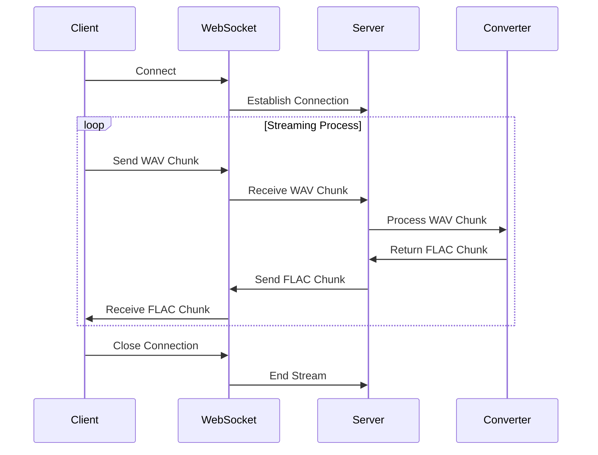

# WAV to FLAC Audio Conversion Service

## Overview

This project is a high-performance backend service developed in Go that converts WAV audio streams to FLAC format in real-time. The service leverages WebSocket connections to provide seamless streaming capabilities with minimal latency while maintaining high audio fidelity.

## Key Features

- 🔄 **Real-Time Streaming**: Processes continuous WAV audio streams and converts them to FLAC format on the fly
- 🌐 **WebSocket Integration**: Uses secure WebSocket (WSS) for bidirectional real-time data streaming
- ⚡ **High Performance**: Optimized for low-latency audio processing with minimal memory footprint
- 🚀 **Scalable Architecture**: Designed to handle multiple concurrent streams efficiently
- 🛠️ **Containerized Deployment**: Ready for deployment in Kubernetes environments
- ✅ **Comprehensive Testing**: Includes both unit and integration tests

## Project Structure

```
wav-to-flac-service/
├── cmd/
│   └── main.go            # Application entry point
├── handlers/
│   └── stream.go          # WebSocket handler implementation
├── services/
│   └── conversion.go      # Audio conversion logic
├── tests/
│   ├── conversion_test.go # Unit tests
│   └── integration_test.go # Integration tests
├── utils/
│   └── logger.go          # Logging utilities
└── README.md
```

## Prerequisites

- Go 1.17 or higher
- Docker
- FFmpeg (for local development)
- Kubernetes (optional, for deployment)

## Quick Start

### Local Development

1. **Clone the repository**
```bash
git clone https://github.com/ayushh2k/wav-to-flac-service.git
cd wav-to-flac-service
```

2. **Install dependencies**
```bash
go mod tidy
```

3. **Run the server**
```bash
go run cmd/main.go
```

### Docker Deployment

1. **Build the image**
```bash
docker build -t wav-to-flac-service .
```

2. **Run the container**
```bash
docker run -p 8080:8080 wav-to-flac-service
```

### Kubernetes Deployment

1. **Tag and push the Docker image**
```bash
docker tag wav-to-flac-service your-dockerhub-username/wav-to-flac-service:latest
docker push your-dockerhub-username/wav-to-flac-service:latest
```

2. **Create deployment configuration**
```yaml
# deployment.yaml
apiVersion: apps/v1
kind: Deployment
metadata:
  name: wav-to-flac-service
spec:
  replicas: 3
  selector:
    matchLabels:
      app: wav-to-flac-service
  template:
    metadata:
      labels:
        app: wav-to-flac-service
    spec:
      containers:
      - name: wav-to-flac-service
        image: your-dockerhub-username/wav-to-flac-service:latest
        ports:
        - containerPort: 8080
```

3. **Create service configuration**
```yaml
# service.yaml
apiVersion: v1
kind: Service
metadata:
  name: wav-to-flac-service
spec:
  selector:
    app: wav-to-flac-service
  ports:
    - protocol: TCP
      port: 80
      targetPort: 8080
  type: LoadBalancer
```

4. **Deploy to Kubernetes**
```bash
kubectl apply -f deployment.yaml
kubectl apply -f service.yaml
```

## API Documentation

### WebSocket Endpoint

- **URL**: `/stream`
- **Protocol**: `WSS`
- **Description**: Establishes a WebSocket connection for bidirectional audio streaming
- **Data Flow**:
  1. Client connects to WebSocket endpoint
  2. Client streams WAV audio data in chunks
  3. Server converts chunks to FLAC format
  4. Server streams converted FLAC data back to client

## Testing

### Run Unit Tests
```bash
go test ./tests/conversion_test.go -v
```

### Run Integration Tests
```bash
go test ./tests/integration_test.go -v
```

## Sequence Diagram



## Performance Considerations

- Implements chunk-based processing to minimize memory usage
- Uses goroutines for concurrent stream handling
- Configurable buffer sizes for optimal performance tuning
- Efficient error handling and resource cleanup

# Running the Client

## Steps

1. **Clone the repository**
    ```bash
    git clone https://github.com/ayushh2k/wav-to-flac-service.git
    cd wav-to-flac-service
    ```

2. **Navigate to the client directory**
    ```bash
    cd client
    ```

3. **Run the client**
    ```bash
    go run main.go -input ./assets/test.wav -output ./assets    
    ```

## Command-Line Flags

- `-input`: Path to the input WAV file
- `-output`: Output directory for the converted FLAC files (default: current directory)

This command will save the output flac stream in the ./assets directory when the client is run.